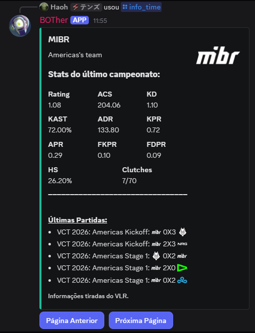
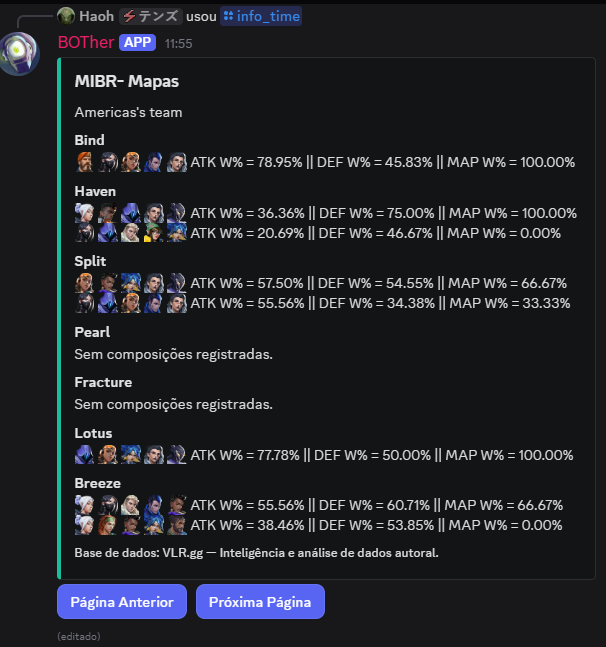
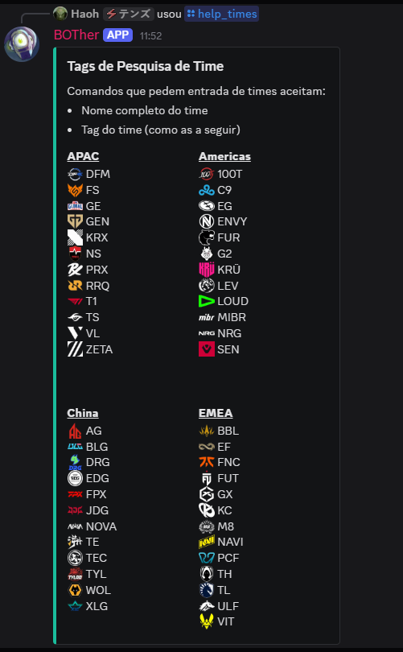

# VlrBot

## Summary
A Valorant bot developed by a Computer Science student as a practical application of Data Engineering and Software Architecture. This project is maintained alongside university commitments, following a weekly sprint cycle to ensure continuous improvement and code quality. It uses web scraping with Selenium on vlr.gg to archive data from VCT matches. It analyzes this data and makes it available for visualization via Discord. We use a PostgreSQL database (hosted on Neon Tech's free plan) to store information about teams and matches. 

### v2.1.0
Now the bot also tracks the performance table from each active tournament (linked to `campeonatos`, see [Database](README.md#database)), capturing metrics like Rating, ACS and ADR to provide deeper match analysis. 

### v2.2.0
**Architectural Refactor:** The code previously contained in `main.py` is now split between `main.py` and `brain.py`. [File Structure](README.md#files--directory-structure) to more information.
**Data Analysis:** Now we can access the information stored in `stats_players`. Integrated Pandas for advanced team statistics (based on player performance).
**New UI:** `info_time` Shows the mean stats of the last tournament (mean of the ACS of each players, for example. Clutches are shown in the format `won/played`, being won and played the sum instead of the mean) in the first page. Received a third page that contais the 'historical stats'. It works the same as the stats of the last tournament, but using data from all the tournaments registered.

#### v2.2.1
**Search Normalization:** Users no longer need to include diacritics to find teams. For example, searching for "kru" will now correctly match "KRÜ".

---

## Features & Showcase

### **Team Analysis (`/info_time`)**
The core command of the bot. It provides a multi-page "book" with deep insights into VCT teams.

- **Page 1: Performance Summary**: Shows average stats from the latest tournament (e.g. Rating, ACS, KAST, ADR) and the team's match history
- **Page 2: Map Performance**: Displays win rates for each composition used in the current map pool, including Attack vs. Defense efficiency.
- **Page 3: Historical records**: Average stats but using the mean of each tournament registered.

<table border="0">
  <tr>
    <td valign="top" width="50%">
      
    </td>
    <td valign="top" width="50%">
      
    </td>
  </tr>
</table>

> **Note:** Page 3 (Historical records) follows the same visual layout as Page 1. Thats why it's not shown. In the section below, we have links for all important files with description. If interested, look for `Screenshots`

### **Search Assistance (`help_times`)**
To ensure precision, this command lists all available teams and their corresponding tags, helping users find exactly what they are looking for.

  

---

## Files & Directory Structure
| File/Folder | Type | Summary |
| :------- | :--: | :------ |
| [Starting v2](./src/starting%20v2.ipynb) | `.ipynb` | Initial planning and first steps for the SQL database. |
| [Auto](./src/auto.py) | `.py` | Web scraping logic featuring `vlr_stealer` and `stats_manager` classes. |
| [DB_handler](./src/DB_handler.py) | `.py` | INSERT logic handled by the `DB_handler` class. |
| [Auto_scrapper.py](./src/auto_scrapper.py) | `.py` | Integration of `auto.py` and `DB_handler.py` (Scraping then inserting into DB). |
| [Disc_buttons](./src/disc_buttons.py) | `.py` | Interactive buttons for navigating Discord embeds. |
| [Main](./src/main.py) | `.py` | Discord interface and bot command handling. |
| [Brain](./src/brain.py) | `.py` | **Back-end logic:** handles database, caching, and data analysis. |
| [Scrapper](./.github/workflows/scrapper.yml) | `.yml` | Automation logic for GitHub Actions. |
| [Agents](./assets/agents) | `dir/ .png` | PNG files used to create Discord emojis for each agent. |
| [Teams](./assets/teams) | `dir/ .png` | PNG files used to create Discord emojis for each team. |
| [Screenshots](./assets/screenshots/) | `dir/ .png` | Screenshots of the bot working. All of them, except [info_time3](./assets/screenshots/info_time3.png), were already shown above. |
| [DB Sch](./assets/DB%20Sch.svg) | `.svg` | Database Schema diagram. |
| [SQL_Script](./assets/sql_script.sql) | `.sql` | Database creation script. |

---

## Database

> **Data Mapping Note:** `stat_players` table may raise errors during insertion if a record contains "N/A". This usually happens when a team changes its tag on vlr.gg (e.g., when DRX changed to KRX), causing a mismatch with the existing database records. While new players are added automatically, team tags must be updated manually in the `times` table to maintain Referential Integrity.

Hosted on PostgreSQL (Neon Tech free plan: 0.5GB storage, 100 CU-hours). The database consists of 9 tables. Descriptions of Portuguese attributes:
- **Agentes**: Agents ('nome' = name)
- **Mapas_lista**: Map list
- **Composicoes**: Team compositions
- **Mapas_jogados**: Played maps ('vencedor_mapa' = map winner)
- **Partidas**: Matches ('vencedor_time_letra' = winning team letter)
- **Campeonatos**: Tournaments ('completo' = completed)
- **Times**: Teams ('regiao' = region)

**Technical Details:**
- **Emojis**: Attributes like `emoji` and `emoji_discord` follow the Discord format: `<:mibr:1370182490953748490>`.
- **Pickban Log**: Formatted as JSON: `{ "Abans": [12, 2], "Bbans": [7, 9], "Apicks": [5], "Bpicks": [4], "decider": 1 }`, where numbers refer to `mapas_lista.id`.
- **Team References**: `atk_str`, `vencedor_mapa`, and `vencedor_time_letra` use 'A' or 'B' values.
- **Round History**: `rounds_string` resembles `BBBBABBBABBBXAABAAAABAB`. 'A'/'B' indicates the winner of that round; 'X' at position 13 marks half-time, and at position 26 marks overtime.
- **Percentage-based attributes**: Stored as decimals (e.g., `0.55` for 55%). Examples are HS and KAST.

---

## Environment Variables (.env)

- `DISCORD_TOKEN`: Your Discord bot token.
- `DATABASE_URL`: Your PostgreSQL connection string.
- `GUILD_ID`: Server ID for testing (remove `guild=...` from commands to sync globally, though this is slower).
- `CREATOR_ID`: Your Discord ID (restricts RAM cache updates to the owner).

---

## How to Run
1. Clone the repository.
2. Install dependencies: `pip install -r requirements.txt`.
3. Set up the Database (see [QuickBuild](#quickbuild-of-database)).
4. Create a `.env` file with your credentials (rename [.env.example](.env.example) and fill it in).
5. Run `python src/auto_scrapper.py` to populate your database.
6. Run `python src/main.py` to start the bot.

---

### QuickBuild of Database
To replicate the database on Neon Tech:
1. Access [Neon Tech Console](https://console.neon.tech/).
2. Create a new project.
3. Open the **SQL Editor**.
4. Copy and execute the [SQL script](./assets/sql_script.sql) provided to generate the tables and foreign keys.
5. Copy your connection string from the dashboard. 
   *Note: Ensure `sslmode=require` is present in the URL.*
6. **Manual Data Seeding:** Some tables do not auto-populate in this version. You should checkout the `discBot_prototype` branch and use `migrar.ipynb` to populate the `times`, `mapas_lista`, and `agentes` tables. Note that some records (like `campeonatos`) must be added manually. You will also need to manually update these tables when new maps or agents are released, or when the map pool changes.

---

### Project Management & Roadmap
This project follows Agile/Scrum principles for development. You can track the Real-time progress, upcoming features, and bug fixes on my [Github Project Board](https://github.com/users/BM-Haoh/projects/2/views/1).

**Current Focus:**
- Releasing project to public