# VlrBot

## Summary
A Valorant bot developed by a Computer Science student as a practical application of Data Engineering and Software Architecture. This project is maintained alongside university commitments, following a weekly sprint cycle to ensure continuous improvement and code quality. It uses web scraping with Selenium on vlr.gg to archive data from VCT matches. It analyzes this data and makes it available for visualization via Discord and a Streamlit Website. We use a PostgreSQL database (hosted on Neon Tech's free plan) to store information about teams and matches. 

### v3.0.0
**Data changes**: Our ecosystem now searches for the new data twice a day. Scraping scheduled for 2:00 UTC and 14:00 UTC, while the bot and website reload data at 7:30 UTC and 19:30 UTC. All of this to ensure that the data is up to date before the matches, allowing users to consult it before or during a match.

**Visualization:** Website (Linked in the "About" section of the repository) is now available. It features the same commands from the original Discord Bot, but with interactive dashboards for better visualization.

---

## Features & Showcase

The ecosystem now provides two distinct interfaces for data consumption, adapting to the user's needs.

### **Accessing commands**
- **Bot**: Using slash commands (`/[command_name]`)
- **Website**: Using the sidebar (top-left):

  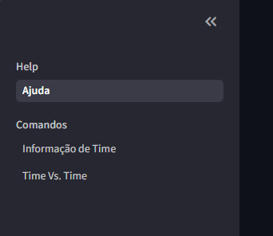

### **Search Assistance (`/help_times`)**
- **Bot**: To ensure precision, this command lists all available teams and their corresponding tags, helping users find exactly what they are looking for.

  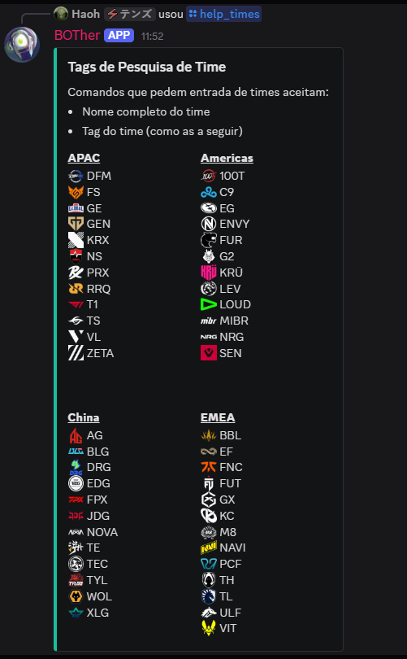

- **Website**: A short explanation (in Portuguese) about how to use the website and its commands, while still dynamically showing each team's tag grouped by region.

  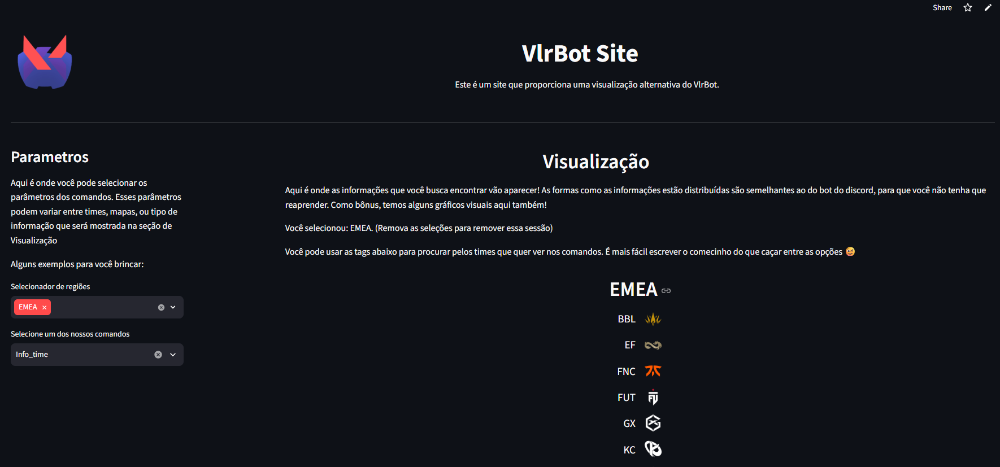
  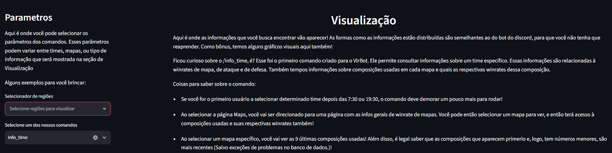

### **Team Analysis (`/info_time`)**
- **Bot**: The core command of the bot. It provides a multi-page "book" interface with deep insights into VCT teams.

  - **Page 1: Performance Summary**: Shows average stats from the latest tournament (e.g., Rating, ACS, KAST, ADR) and the team's match history
  - **Pages 2-8: Map Performance**: Displays win rates for the last 3 compositions used in the current map pool, including Attack vs. Defense efficiency.
  - **Page 9: Historical records**: Average stats but using the mean of all registered tournaments.

<table border="0">
  <tr>
    <td valign="top" width="50%">
      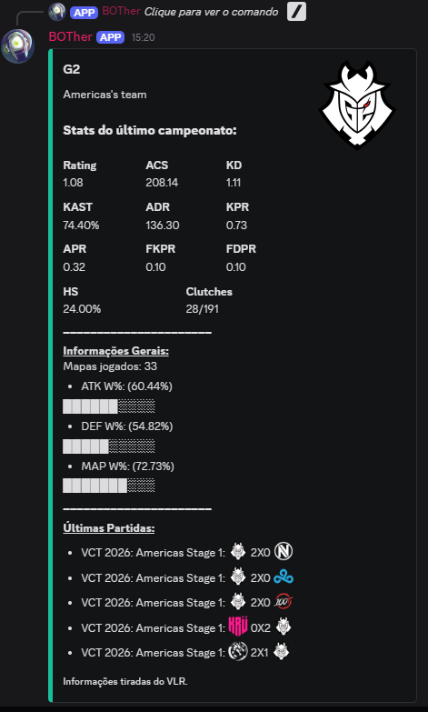
    </td>
    <td valign="top" width="50%">
      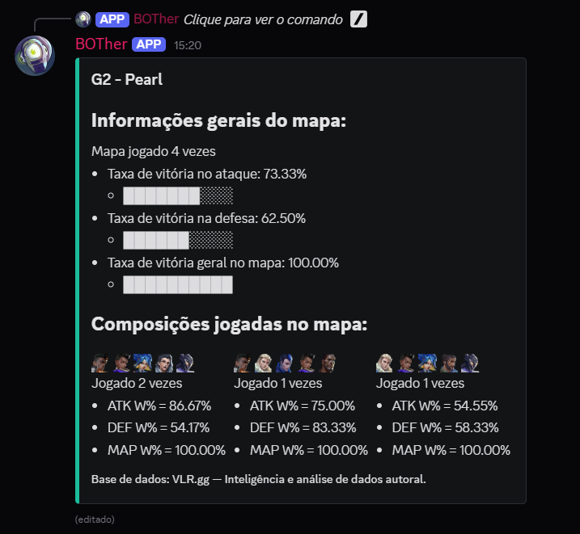
      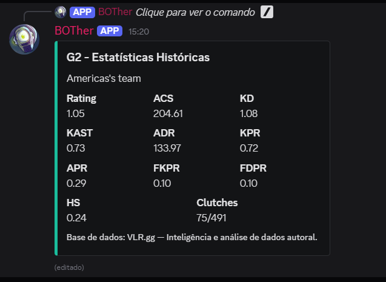
    </td>
  </tr>
</table>

- **Website**: Displays the same data structured into interactive dashboards (excluding the Historical Records page).

<table border="0">
  <tr>
    <td valign="top" width="50%">
      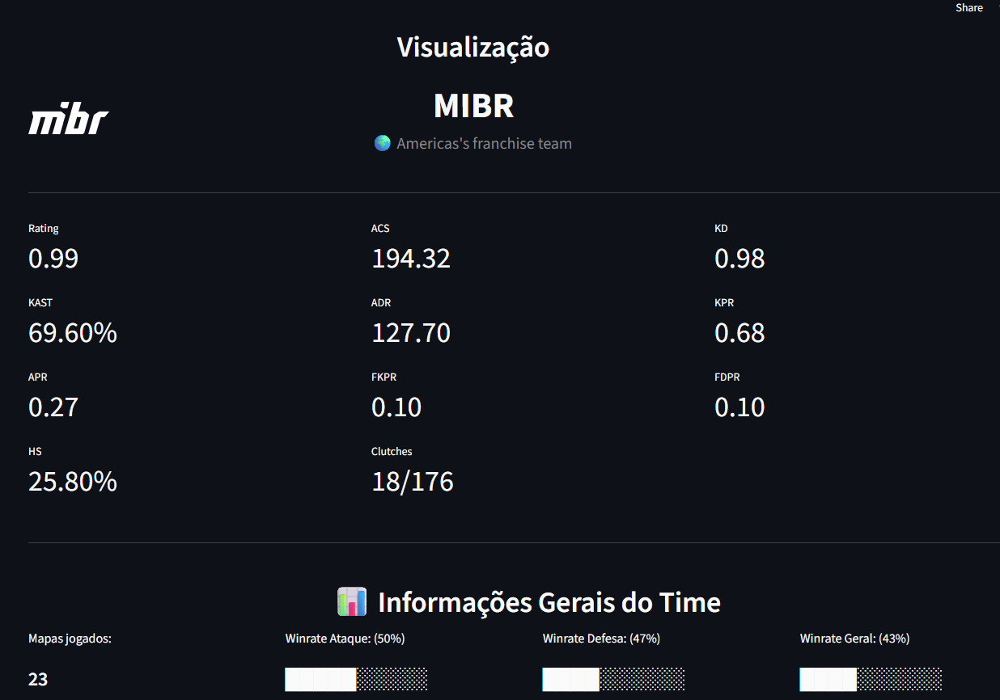
    </td>
    <td valign="top" width="50%">
      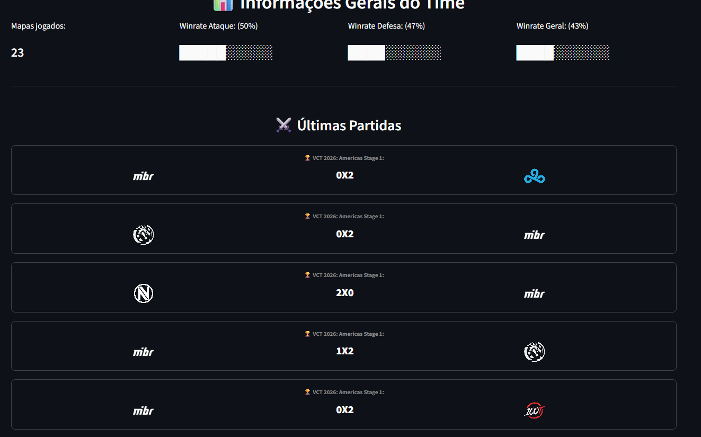
    </td>
  </tr>
  <tr>
    <td valign="top" width="50%">
      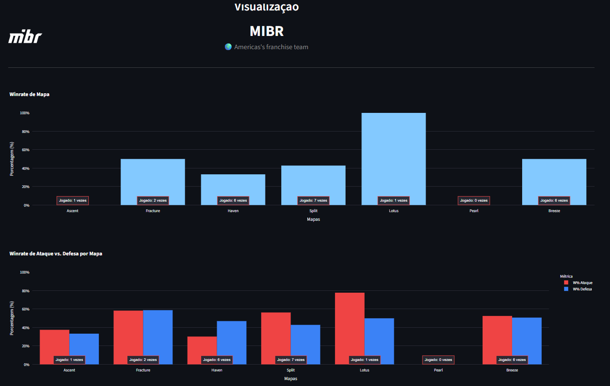
    </td>
    <td valign="top" width="50%">
      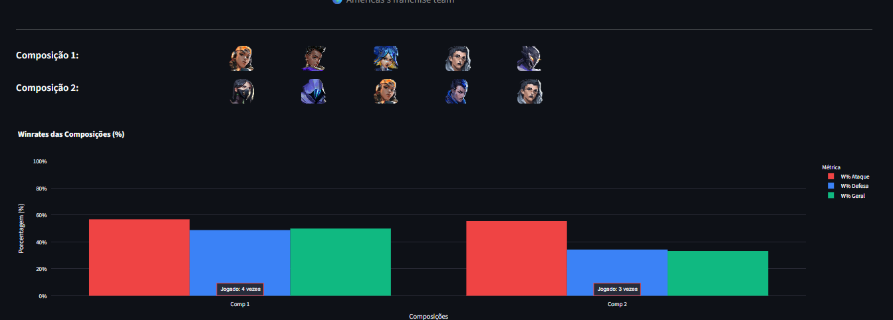
    </td>
  </tr>
</table>

### **Head-to-Head Comparison (`/times_vs`)**
An advanced comparison command that merges data from two distinct `/info_time` targets into a single, unified Embed Book for enhanced matchup visualization.

- **First Page: Performance Summary (Overview)**: Side-by-side metric comparison from the latest tournament and recent match histories.
- **Intermediary Pages: Map Performance**: Matchup-specific analytics comparing win rates and side advantages (Attack vs. Defense efficiency) on selected maps.
- **Final Page: Historical Records**: Lifetime average stats compared across all database records.

<table border="0">
  <tr>
    <td valign="top" width="50%">
      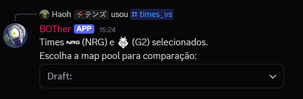
      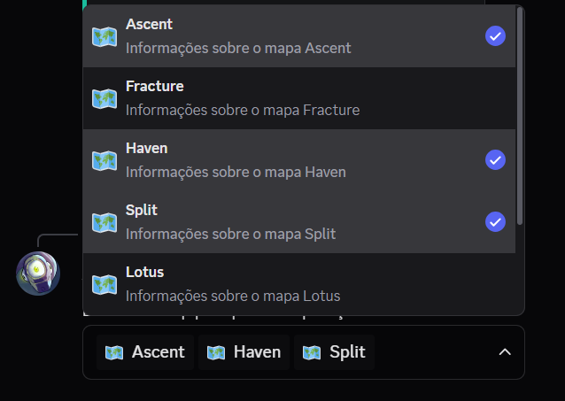
    </td>
    <td valign="top" width="50%">
      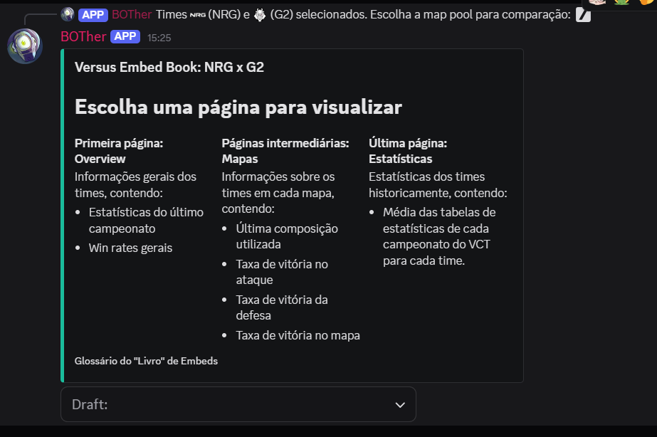
      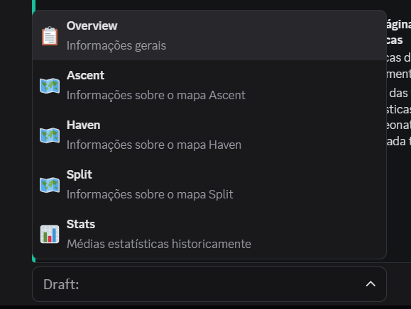
    </td>
  </tr>
</table>

> Note: Above is the first response of the bot, prompt-asking for the maps for comparison with `Menu(tipo=1)`

<table border="0">
  <tr>
    <td valign="top" width="50%">
      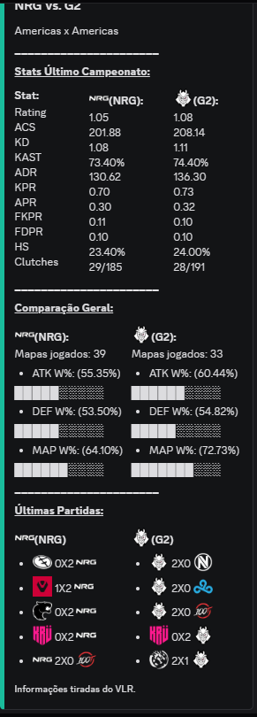
    </td>
    <td valign="top" width="50%">
      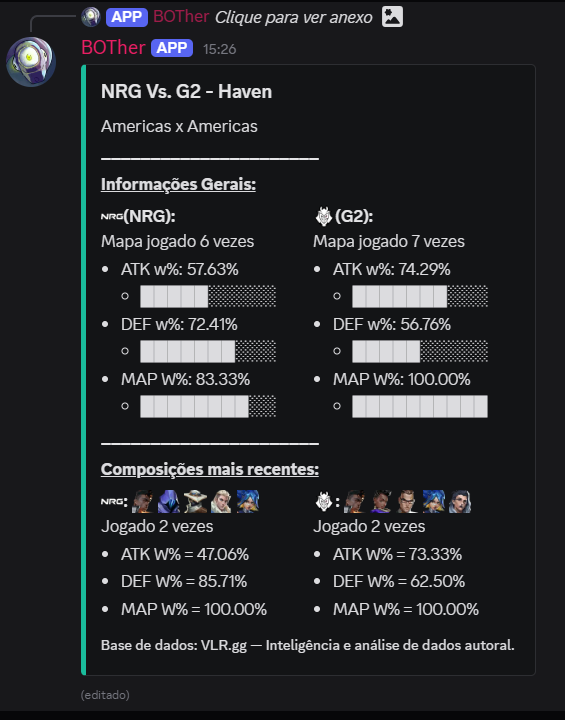
      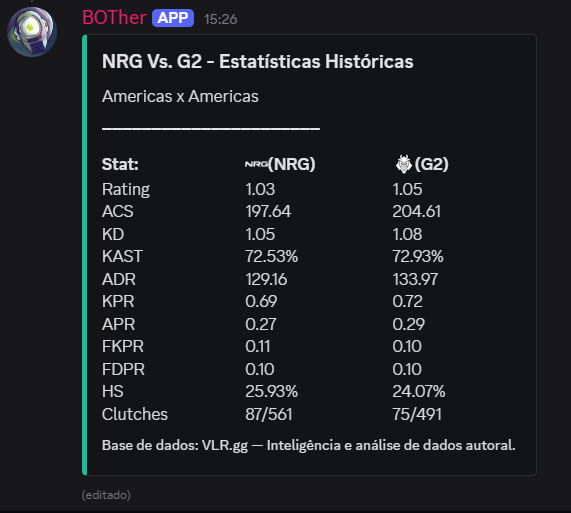
    </td>
  </tr>
</table>

> Note: Above is each page of the `Versus Embed Book`

- **Website**: A seamless interface allowing the selection of both teams and displaying interactive side-by-side dashboards:

  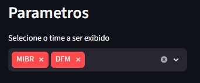

<table border="0">
  <tr>
    <td valign="top" width="50%">
      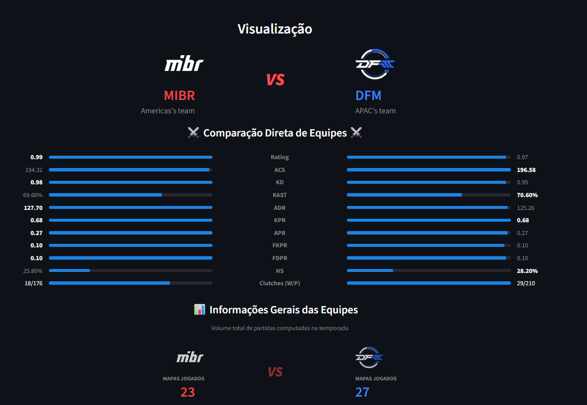
    </td>
    <td valign="top" width="50%">
      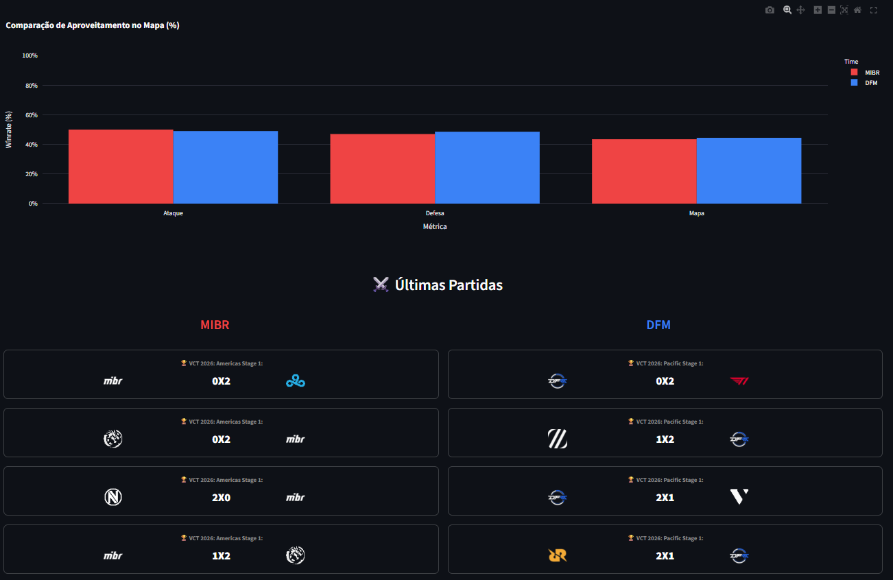
    </td>
  </tr>
  <tr>
    <td valign="top" width="50%">
      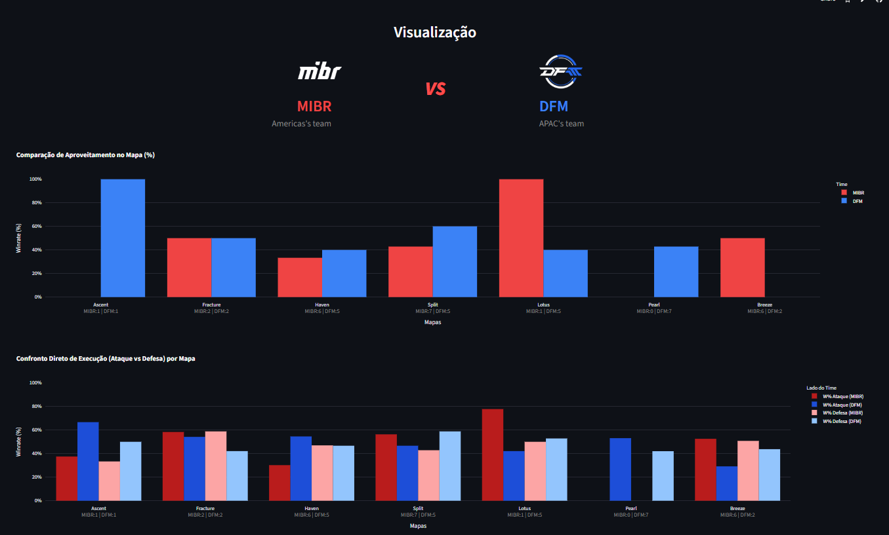
    </td>
    <td valign="top" width="50%">
      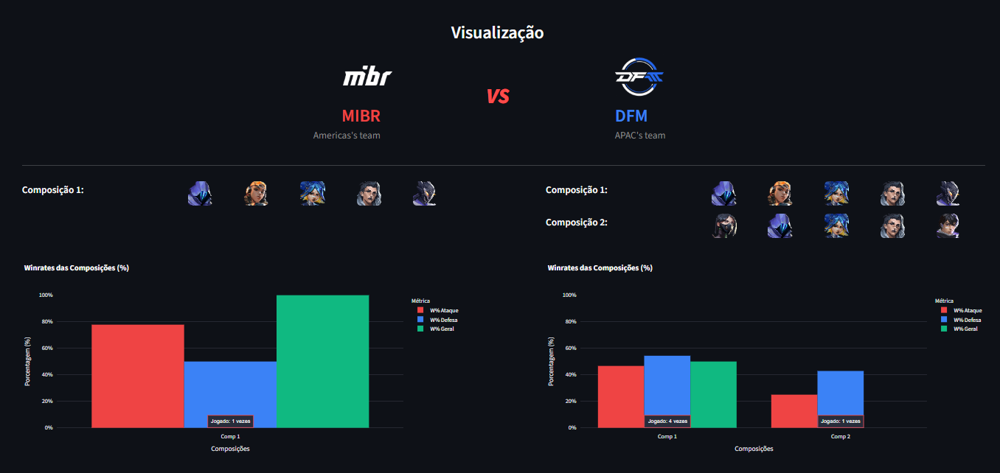
    </td>
  </tr>
</table>

---

## Files & Directory Structure
| File/Folder | Type | Summary |
| :------- | :--: | :------ |
| [Starting v2](./src/starting%20v2.ipynb) | `.ipynb` | Initial planning and first steps for the SQL database. |
| [Auto](./src/auto.py) | `.py` | Web scraping logic featuring `vlr_stealer` and `stats_manager` classes. |
| [DB_handler](./src/DB_handler.py) | `.py` | INSERT logic handled by the `DB_handler` class. |
| [Auto_scraper.py](./src/auto_scraper.py) | `.py` | Integration of `auto.py` and `DB_handler.py` (Scraping then inserting into DB). |
| [Disc_buttons](./src/disc_buttons.py) | `.py` | Interactive buttons for navigating Discord embeds. |
| [Main](./src/main.py) | `.py` | Discord interface and bot command handling. |
| [Site](./src/site.py) | `.py` | Main entry point for the Streamlit web application. |
| [Website](./src/website/) | `dir/ .py` | Modular components and utility files for the website. |
| ⤷ [Data Loader](./src/website/data_loader.py) | `.py` | Handles data retrieval and caching operations. |
| ⤷ [Pages](./src/website/pages.py) | `.py` | Contains rendering functions for each individual page of the web application. |
| [Brain](./src/brain.py) | `.py` | **Back-end logic:** handles database, caching, and data analysis. |
| [Scraper](./.github/workflows/scraper.yml) | `.yml` | Automation logic for GitHub Actions. |
| [Agents](./assets/agents) | `dir/ .png` | PNG files used to create Discord emojis for each agent. |
| [Teams](./assets/teams) | `dir/ .png` | PNG files used to create Discord emojis for each team. |
| [Screenshots](./assets/screenshots/) | `dir/ .png` | Screenshots of the bot working. All of them, except [info_time3](./assets/screenshots/info_time3.png), were already shown above. |
| [Documentation](./docs/) | `dir/ .md` | Project documentation and UML Diagram. |
| ⤷ [Requirements](./docs/Requisitos.md) | `.md` | Functional and Non-Functional Requirements. |
| ⤷ [Classes](./docs/Diagramas%20de%20Classe.md) | `.md` | Class Diagram representing the system structure. |
| ⤷ [Sequence](./docs/Diagramas%20de%20Sequência.md) | `.md` | Sequence Diagram showing object interactions. |
| ⤷ [Deployment](./docs/Diagrama%20de%20Implantação.md) | `.md` | Deployment Diagram showing infrastructure and cloud services. |
| ⤷ [Privacy](./docs/PRIVACY_POLICY.md) | `.md` | Privacy Policy regarding data handling. |
| ⤷ [Terms](./docs/TERMS_OF_SERVICE.md) | `.md` | Terms of Service for bot and dashboard usage. |
| [DB Sch](./assets/DB%20Sch.svg) | `.svg` | Database Schema diagram. |
| [SQL_Script](./assets/sql_script.sql) | `.sql` | Database creation script. |

---

## Architecture & Deployment

Below is the deployment architecture of the system, ilustrating how the different cloud services and containers interact:

[![Deployment Architecture Diagram](https://img.plantuml.biz/plantuml/svg/lLRBRjj84BmBu3yqv4Fa0v74co0BGp0YavQZnIQhHCu6M0G8HiCMHMWuJSmCBGj1lYQ7V8X_B3qSogi7DpUl3pwmgwiVLKtgjNN2kBfKKS-k2bq98qgmRgEG_vj27eP6nj3wPbd8bKPhuVbUsb9aj2vq3ixK6FMYtXD8I2-Al3RY_iVzTu8CuSgwGf7TJTIKuN0uAIk59Mg7sSK5V8rwm7-NGgvoGxNE4b9au2HzSPMcepP89aFJ1iv-7xrwyJBgVTjbbbHMf9dpSUXvTSL2o4TddogXzI-Pn-FnRqdQmJmU9y-VlTeDp1frCs6Nc1rK34ByNzLsn7dSajw88qS6BI3CqDmMzp_8mjMTGwEz5VtSqFzeqVI7mmnl2udSYh1GywFTy5b7_CmNa8hg3FffOINt01EzC88FgEO3CjY7av7Yd4jLutR0X-6XFrFSAbzAMGgTsJuSkedhM0z9sc7QMjU5UrFFmppIrxXUadMVbeLxAB9r4DUWsaZa8XdsE_W_O4KX9SpQSe-aAqXtjDJo7moIJ9ucAKoB2bMXqMVzgoiNsGOwSqUreoypQKHLiGfTE_286PnCXS9hWwW3pRVzfQGaLsY0c-U5J6x9R8vtqM8cfSZH7dLPD8_tMMVEe2XLuI3n3_PpZWLDXHEGic9p4YOxgk2TsV9dZ9mBonj_XwJX1kKI1bEMCJSuU__dQUSYqai8dcvSXjvcx381Mi1VHaZs_c1CKcJyXFWatEdMmMsqcG7-VjivHa2sAxhIUPUGMHFzWlhsFuomFGCkxhy0JZ1BjwXpSliwFc4lAY7PTiBZ_7Nw8uFueZq2EEUv-N15uytF-d83RRc0F8DOuS8ntk-v0xt6kUKRuJTHu1l6fiYNFe6ROVorSBWM6_Y4yvaVrC4WhRdjkzFGtrZLT_mb8zYw5GOVAEFJ9R_lS3dDolaEcT5H2RHetNlEBnsKDOyFymqaXZN_W-QVzU0blmy_tYJ7UIpsUPDi9HiV7C4_Q6Yl4uGKAqMRgEVF66B-26kUPdjkd7_34-Q-qMbjbrpZ8HGpBXYUKJuOhYBgjGyVLhCZkGSgjGKsIuxhYZ5DzT1i73g20I_n3T6gMLtK2qk8uy6pE0wJiSbXKDcDf2e_XQUmDeqqWVK0npV86dkHViKGK57lDUgCVxpy1000)](https://editor.plantuml.com/uml/lLRBRjj84BmBu3yqv4Fa0v74co0BGp0YavQZnIQhHCu6M0G8HiCMHMWuJSmCBGj1lYQ7V8X_B3qSogi7DpUl3pwmgwiVLKtgjNN2kBfKKS-k2bq98qgmRgEG_vj27eP6nj3wPbd8bKPhuVbUsb9aj2vq3ixK6FMYtXD8I2-Al3RY_iVzTu8CuSgwGf7TJTIKuN0uAIk59Mg7sSK5V8rwm7-NGgvoGxNE4b9au2HzSPMcepP89aFJ1iv-7xrwyJBgVTjbbbHMf9dpSUXvTSL2o4TddogXzI-Pn-FnRqdQmJmU9y-VlTeDp1frCs6Nc1rK34ByNzLsn7dSajw88qS6BI3CqDmMzp_8mjMTGwEz5VtSqFzeqVI7mmnl2udSYh1GywFTy5b7_CmNa8hg3FffOINt01EzC88FgEO3CjY7av7Yd4jLutR0X-6XFrFSAbzAMGgTsJuSkedhM0z9sc7QMjU5UrFFmppIrxXUadMVbeLxAB9r4DUWsaZa8XdsE_W_O4KX9SpQSe-aAqXtjDJo7moIJ9ucAKoB2bMXqMVzgoiNsGOwSqUreoypQKHLiGfTE_286PnCXS9hWwW3pRVzfQGaLsY0c-U5J6x9R8vtqM8cfSZH7dLPD8_tMMVEe2XLuI3n3_PpZWLDXHEGic9p4YOxgk2TsV9dZ9mBonj_XwJX1kKI1bEMCJSuU__dQUSYqai8dcvSXjvcx381Mi1VHaZs_c1CKcJyXFWatEdMmMsqcG7-VjivHa2sAxhIUPUGMHFzWlhsFuomFGCkxhy0JZ1BjwXpSliwFc4lAY7PTiBZ_7Nw8uFueZq2EEUv-N15uytF-d83RRc0F8DOuS8ntk-v0xt6kUKRuJTHu1l6fiYNFe6ROVorSBWM6_Y4yvaVrC4WhRdjkzFGtrZLT_mb8zYw5GOVAEFJ9R_lS3dDolaEcT5H2RHetNlEBnsKDOyFymqaXZN_W-QVzU0blmy_tYJ7UIpsUPDi9HiV7C4_Q6Yl4uGKAqMRgEVF66B-26kUPdjkd7_34-Q-qMbjbrpZ8HGpBXYUKJuOhYBgjGyVLhCZkGSgjGKsIuxhYZ5DzT1i73g20I_n3T6gMLtK2qk8uy6pE0wJiSbXKDcDf2e_XQUmDeqqWVK0npV86dkHViKGK57lDUgCVxpy1000)

> further diagrams or detailed description is contained in `docs\` files. Consult [File Structure](./README.md#files--directory-structure) to find them.

---

## Database

> **Data Mapping Note:** `stats_players` table may raise errors during insertion if a record contains "N/A". This usually happens when a team changes its tag on vlr.gg (e.g., when DRX changed to KRX), causing a mismatch with the existing database records. While new players are added automatically, team tags must be updated manually in the `times` table to maintain Referential Integrity.

Hosted on PostgreSQL (Neon Tech free plan: 0.5GB storage, 100 CU-hours). The database consists of 9 tables. Descriptions of Portuguese attributes:
- **Agentes**: Agents ('nome' = name)
- **Mapas_lista**: Map list
- **Composicoes**: Team compositions
- **Mapas_jogados**: Played maps ('vencedor_mapa' = map winner)
- **Partidas**: Matches ('vencedor_time_letra' = winning team letter)
- **Campeonatos**: Tournaments ('completo' = completed)
- **Times**: Teams ('regiao' = region)

**Technical Details:**
- **Emojis**: Attributes like `emoji` and `emoji_discord` follow the Discord format: `<:mibr:1370182490953748490>`.
- **Pickban Log**: Formatted as JSON: `{ "Abans": [12, 2], "Bbans": [7, 9], "Apicks": [5], "Bpicks": [4], "decider": 1 }`, where numbers refer to `mapas_lista.id`.
- **Team References**: `atk_str`, `vencedor_mapa`, and `vencedor_time_letra` use 'A' or 'B' values.
- **Round History**: `rounds_string` resembles `BBBBABBBABBBXAABAAAABAB`. 'A'/'B' indicates the winner of that round; 'X' at position 13 marks half-time, and at position 26 marks overtime.
- **Percentage-based attributes**: Stored as decimals (e.g., `0.55` for 55%). Examples are HS and KAST.

---

## Environment Variables (.env)

- `DISCORD_TOKEN`: Your Discord bot token.
- `DATABASE_URL`: Your PostgreSQL connection string.
- `GUILD_ID`: Server ID for testing (remove `guild=...` from commands to sync globally, though this is slower).
- `CREATOR_ID`: Your Discord ID (restricts RAM cache updates to the owner).

---

## How to Run
1. Clone the repository.
2. Install dependencies: `pip install -r requirements.txt`.
3. Set up the Database (see [QuickBuild](#quickbuild-of-database)).
4. Create a `.env` file with your credentials (rename [.env.example](.env.example) and fill it in).
5. Run `python src/auto_scraper.py` to populate your database.
6. Run `python src/main.py` to start the bot.

---

### QuickBuild of Database
To replicate the database on Neon Tech:
1. Access [Neon Tech Console](https://console.neon.tech/).
2. Create a new project.
3. Open the **SQL Editor**.
4. Copy and execute the [SQL script](./assets/sql_script.sql) provided to generate the tables and foreign keys.
5. Copy your connection string from the dashboard. 
   *Note: Ensure `sslmode=require` is present in the URL.*
6. **Manual Data Seeding:** Some tables do not auto-populate in this version. You should checkout the `discBot_prototype` branch and use `migrar.ipynb` to populate the `times`, `mapas_lista`, and `agentes` tables. Note that some records (like `campeonatos`) must be added manually. You will also need to manually update these tables when new maps or agents are released, or when the map pool changes.

---

### Project Management & Roadmap
This project follows Agile/Scrum principles for development. You can track the Real-time progress, upcoming features, and bug fixes on my [Github Project Board](https://github.com/users/BM-Haoh/projects/2/views/1).

**Current Focus:**
- Enhancing info_time command to better UX